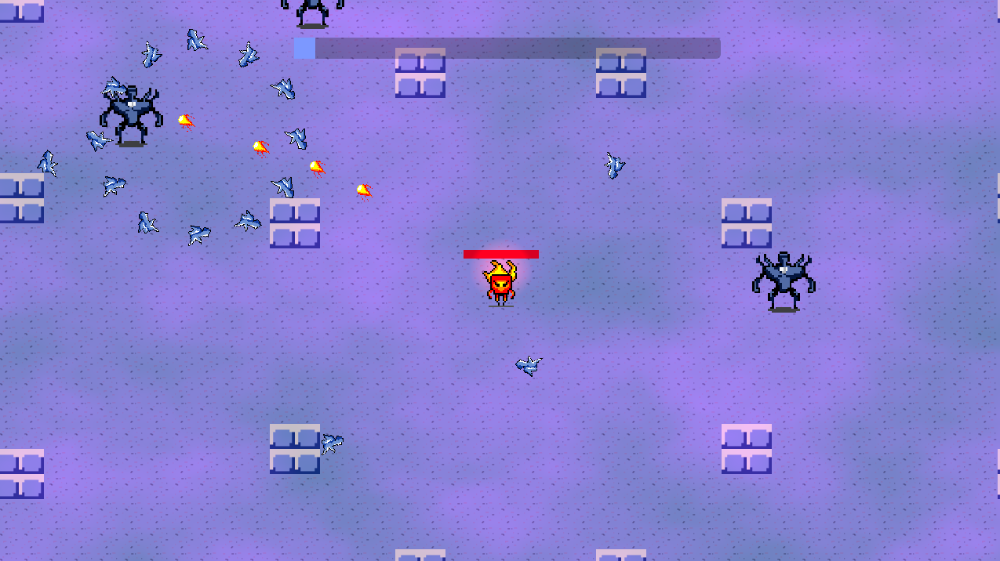

# Itch.io Bullet Hell V Game Jam 2024

### 
Bullet Hell V: Fire & Ice

Play the game: https://alexshopov.itch.io/fire-and-ice

https://itch.io/jam/bullet-hell-v

Theme: **Consequences**

This is my first game jam, as well as my first exploration into learning Godot. My goal is to create a simple but polished and fun entry that will allow me to experiment with different Godot nodes and hack around with GDScript. The
core of the game is based on the [Your first 2D Game](https://docs.godotengine.org/en/stable/getting_started/first_2d_game/index.html)
tutorial from the official Godot Docs. I ran through the tutorial to get a feel for the engine, then replaced
the provided assets and started expanding and re-writing the code to create this bullet hell experience.

## 
Development Process

### Tools

GDScript was written and debugged using [VSCode](https://code.visualstudio.com/).

Sprite and background assets were created in [Gimp](https://www.gimp.org/).

Additional sound and music were sourced from [OpenGameArt.org](https://opengameart.org/) and [Zapsplat.com](https://www.zapsplat.com). See the in game credits or [Credits](#Credits) section below.

## 
Credits

### Background Music

"Action Music"\
Music by [Marcelo Fernandez](http://www.marcelofernandezmusic.com).\
Obtained from [OpenGameArt.org](https://opengameart.org/content/action-music-pack)\
Licensed under [Creative Commons Attribution 4.0 International](http://creativecommons.org/licenses/by/4.0/).

### Voice Acting
Victor Shopov

### Sound Effects
"Atari Fire" \
Sound by dklon \
Obtained from [OpenGameArt.org](https://opengameart.org/content/atari-fire)\
Licensed under [Creative Commons Attribution 4.0 International](http://creativecommons.org/licenses/by/3.0/).

"Whoosh Fire Flames Fast 003" \
Obtained from [Zapsplat.com](https://www.zapsplat.com/music/designed-fast-fire-and-flame-whoosh-3/) \
Licensed under [Creative Commons Attribution 4.0 International](http://creativecommons.org/licenses/by/4.0/).